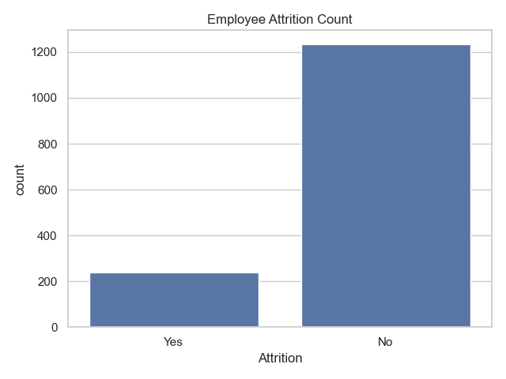
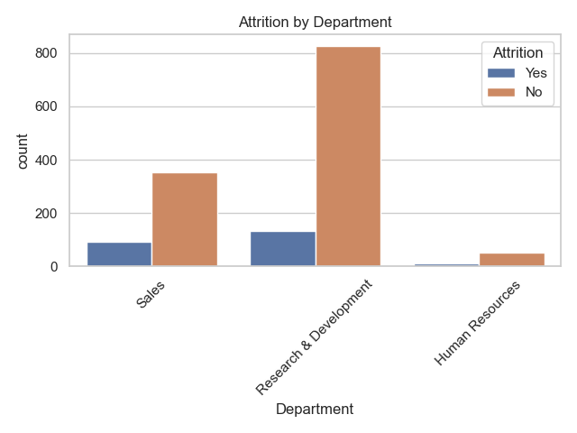
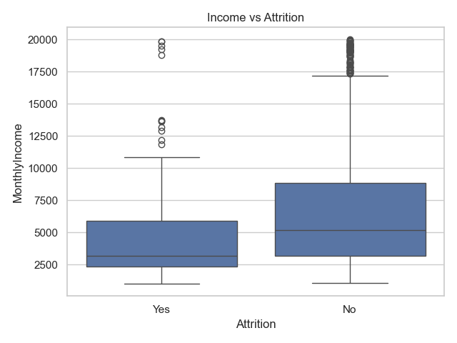
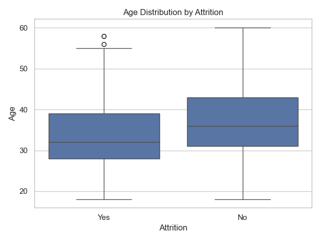

# HR Employee Attrition Analysis

## Project Overview

Employee attrition can significantly impact organizational productivity, morale, and operational costs. Understanding why employees leave helps companies develop strategies to improve retention and workforce stability.

This project analyzes the **IBM HR Analytics dataset** to identify patterns and potential drivers of employee attrition. Using Python for data analysis and visualization, the project explores employee demographics, income patterns, department-level attrition, and other factors that may influence employee turnover.

The analysis produces summary metrics, visual insights, and exported analytical tables that can support data-driven HR decision-making.

---

## Dataset Information

**Dataset:** IBM HR Employee Attrition Dataset
**Total Employees:** 1,470
**Total Features:** 35 variables

The dataset includes employee information such as:

* Age
* Department
* Job Role
* Monthly Income
* Overtime status
* Years at company
* Work-life balance
* Job satisfaction
* Education level

These variables allow us to explore potential relationships between employee characteristics and attrition.

---

## Tools and Technologies Used

This project was built using the following tools:

* **Python**
* **Pandas** – data manipulation and analysis
* **Seaborn** – statistical visualization
* **Matplotlib** – chart generation
* **VS Code** – development environment
* **Git & GitHub** – version control and portfolio hosting

---

## Project Structure

```
hr_attrition_analysis
│
├── charts
│   ├── attrition_count.png
│   ├── attrition_by_department.png
│   ├── income_vs_attrition.png
│   └── age_vs_attrition.png
│
├── outputs
│   ├── attrition_by_department.csv
│   ├── attrition_by_jobrole.csv
│   └── attrition_by_overtime.csv
│
├── employee_attrition_analysis.py
├── ibm_hr.csv
└── README.md
```

---

## Analysis Performed

The Python analysis script performs the following steps:

1. **Data Loading**

   * Loads the HR dataset using a path relative to the script location.

2. **Data Exploration**

   * Displays dataset structure
   * Prints column names
   * Shows sample rows
   * Reviews dataset size and structure

3. **Attrition Metrics**

   * Total employees
   * Number of employees who left
   * Attrition rate
   * Average age of employees who left
   * Average monthly income of employees who left

4. **Department & Role Analysis**

   * Attrition rates by department
   * Attrition rates by job role
   * Attrition rates by overtime status

5. **Data Visualization**

   * Attrition count distribution
   * Department-level attrition comparison
   * Income vs attrition comparison
   * Age distribution by attrition status

6. **Exported Outputs**

   * Aggregated attrition tables
   * Visualization images for reporting

---

## Key Metrics

| Metric                                      | Value           |
| ------------------------------------------- | --------------- |
| Total Employees                             | 1470            |
| Employees Who Left                          | 237             |
| Attrition Rate                              | **16.12%**      |
| Average Age of Employees Who Left           | **33.61 years** |
| Average Monthly Income (Employees Who Left) | **$4,787**      |

---

## Key Insights

### 1. Attrition Rate

The organization experiences an attrition rate of **16.12%**, meaning approximately one out of every six employees has left the company.

### 2. Age Trend

Employees who left had an **average age of 33.6 years**, indicating that early-to-mid career professionals may be more likely to leave.

### 3. Department-Level Attrition

Analysis of department-level turnover shows that **Sales tends to have the highest attrition rate**, suggesting possible pressure, workload, or compensation competitiveness issues in revenue-focused teams.

### 4. Income Influence

Employees who left had an average monthly income of **$4,787**, which may indicate compensation competitiveness plays a role in employee retention.

### 5. Workload Factors

Employees working **overtime** show higher attrition tendencies, suggesting workload and work-life balance could be contributing factors.

---

## Visualizations

### Attrition Count



### Attrition by Department



### Monthly Income vs Attrition



### Age Distribution by Attrition



---

## Business Implications

Based on the analysis, organizations could consider:

* Reviewing compensation structures in high-turnover departments
* Investigating workload balance and overtime policies
* Improving retention programs for early-career employees
* Strengthening engagement and satisfaction initiatives in sales teams

---

## Future Improvements

Possible enhancements to this analysis include:

* Predictive modeling for attrition risk
* Machine learning classification models
* Employee segmentation analysis
* Time-series workforce trend analysis
* Interactive dashboards using Power BI or Tableau

---

## Conclusion

This project demonstrates how Python-based data analysis can be used to extract meaningful workforce insights from HR data. By combining data exploration, statistical summaries, and visual analytics, organizations can better understand employee turnover patterns and develop data-driven strategies to improve employee retention.
